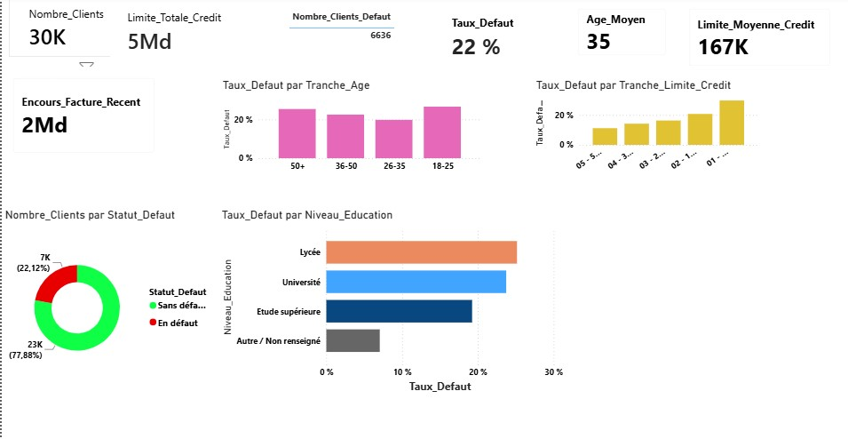
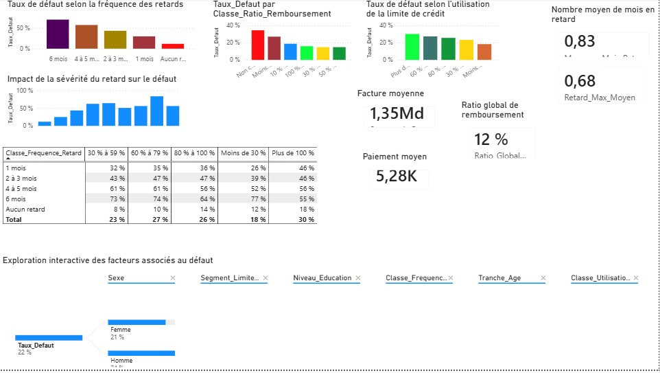
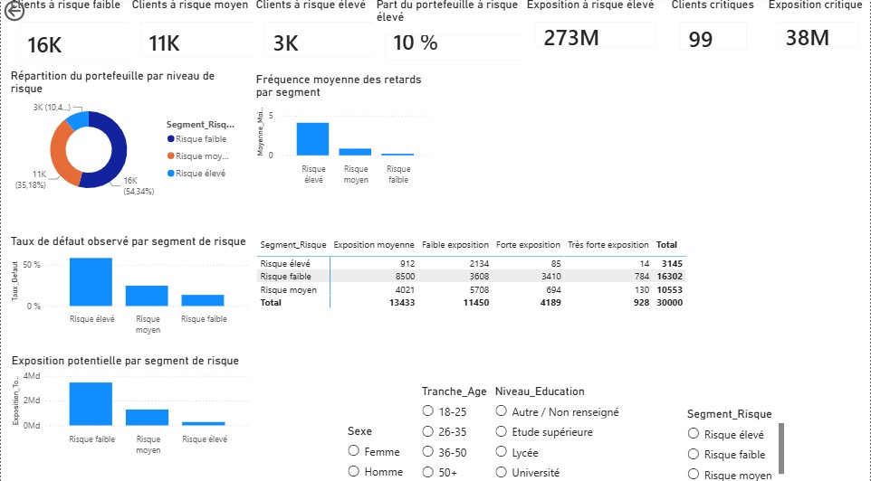
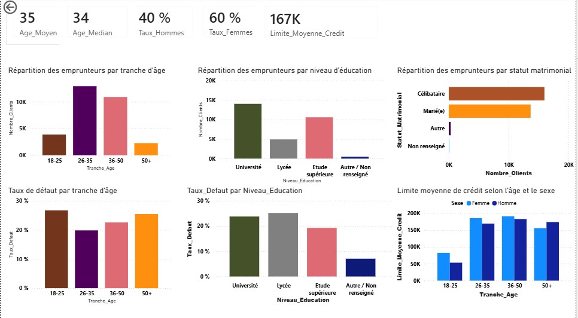
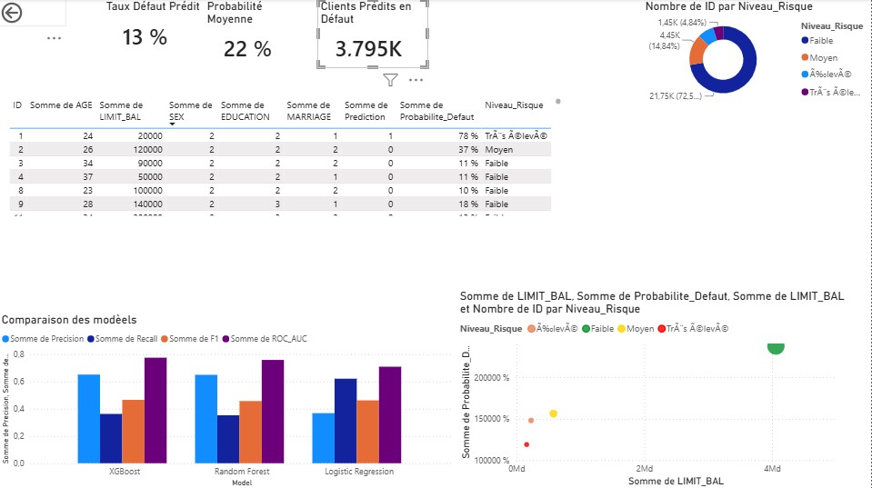

# 📊 Prédiction du Risque de Défaut de Crédit avec Power BI et Machine Learning


---

# 📑 Sommaire

- Présentation
- Objectifs
- Structure du projet
- Technologies utilisées
- Méthodologie
- Pipeline du projet
- Tableau de bord Power BI
- Modélisation Machine Learning
- Résultats
- Perspectives
- Installation
- Contact

---

# 📌 Présentation du projet

L’évaluation du risque de défaut constitue un enjeu majeur pour les établissements financiers. Une mauvaise estimation du risque peut entraîner des pertes importantes, tandis qu’une bonne anticipation permet d’améliorer la qualité du portefeuille de crédit et les décisions d’octroi.

Ce projet propose une solution complète combinant **Business Intelligence** et **Machine Learning** afin de construire un système d’aide à la décision permettant :

- d'analyser le portefeuille de crédit ;
- d'identifier les principaux facteurs de risque ;
- de segmenter les emprunteurs selon leur niveau de risque ;
- de comparer plusieurs modèles de Machine Learning ;
- de prédire la probabilité de défaut de chaque client ;
- d'intégrer ces prédictions dans un tableau de bord Power BI interactif.

L'ensemble du projet suit une approche **End-to-End Data Science**, depuis la préparation des données jusqu'à la restitution des résultats dans Power BI.

---

# 🎯 Objectifs

Les principaux objectifs sont :

- Comprendre le profil des emprunteurs.
- Réaliser une analyse exploratoire des données.
- Identifier les variables les plus influentes sur le défaut.
- Construire plusieurs modèles prédictifs.
- Comparer leurs performances.
- Sélectionner le meilleur modèle.
- Intégrer les probabilités de défaut dans Power BI.
- Développer un outil d'aide à la décision destiné aux établissements financiers.

---

# 📂 Structure du projet

```text
Credit-Risk-Prediction-PowerBI-ML
│
├── data
│   ├── PredictionClients.csv
│   ├── FeatureImportance.csv
│   └── Model_Comparison.csv
│
├── images
│
├── powerbi
│   └── Credit Risk Prediction.pbix
│
├── python
│   └── Credit_Risk_Prediction.py
│
├── README.md
├── requirements.txt
└── LICENSE
```

---

# 🛠️ Technologies utilisées

| Technologie | Utilisation |
|-------------|-------------|
| Python | Préparation des données |
| Pandas | Manipulation des données |
| NumPy | Calcul scientifique |
| Scikit-learn | Régression Logistique & Random Forest |
| XGBoost | Modèle prédictif |
| Power BI | Tableau de bord |
| DAX | Création des KPI |
| Power Query | Nettoyage des données |
| GitHub | Versioning et Portfolio |

---

# 🔬 Méthodologie

Le projet suit une démarche complète de Data Science.

## 1️⃣ Collecte des données

Le projet repose sur le jeu de données **Default of Credit Card Clients**, contenant :

- 30 000 clients
- 24 variables
- 1 variable cible (Defaut)

Les principales variables utilisées sont :

- LIMIT_BAL
- SEX
- AGE
- EDUCATION
- MARRIAGE
- PAY_0 à PAY_6
- BILL_AMT1 à BILL_AMT6
- PAY_AMT1 à PAY_AMT6

Variable cible :

- 0 : Aucun défaut
- 1 : Défaut de paiement

---

## 2️⃣ Préparation des données

Les principales étapes de préparation sont :

- renommage de la variable cible ;
- suppression des variables inutiles ;
- vérification des valeurs manquantes ;
- normalisation des variables numériques (Régression Logistique) ;
- séparation des variables explicatives et de la variable cible ;
- création des jeux d'entraînement (80 %) et de test (20 %).

---

## 3️⃣ Analyse exploratoire

L'analyse exploratoire a été réalisée dans Power BI afin de comprendre :

- le profil des emprunteurs ;
- les habitudes de remboursement ;
- les retards de paiement ;
- les montants facturés ;
- les limites de crédit ;
- les facteurs influençant le défaut.

Cette étape a permis de construire les indicateurs du tableau de bord.

---

## 4️⃣ Développement des modèles

Trois modèles de Machine Learning ont été développés :

- Régression Logistique
- Random Forest
- XGBoost

Chaque modèle est entraîné sur le même jeu de données afin de garantir une comparaison équitable.

---

## 5️⃣ Évaluation des modèles

Les modèles sont comparés selon plusieurs métriques :

- Accuracy
- Precision
- Recall
- F1-score
- ROC-AUC

Le meilleur modèle est automatiquement sélectionné afin de générer les probabilités individuelles de défaut.

---

## 6️⃣ Intégration dans Power BI

Les probabilités générées sont exportées sous forme de fichier CSV puis réintégrées dans Power BI.

Cette intégration permet :

- d'estimer le risque de chaque client ;
- de segmenter automatiquement les emprunteurs ;
- d'identifier les clients les plus risqués ;
- d'améliorer la prise de décision.

---

# 🔄 Pipeline du projet

```text
                Jeu de données
                       │
                       ▼
           Préparation des données
                       │
                       ▼
        Analyse exploratoire (Power BI)
                       │
                       ▼
       Construction des modèles Python
                       │
          ┌────────────┼─────────────┐
          ▼            ▼             ▼
Régression Logistique Random Forest XGBoost
          │            │             │
          └────────────┼─────────────┘
                       ▼
      Comparaison des performances
                       │
                       ▼
      Sélection du meilleur modèle
                       │
                       ▼
 Génération des probabilités de défaut
                       │
                       ▼
        Intégration dans Power BI
                       │
                       ▼
 Tableau de bord décisionnel
```

---

# 📈 Tableau de bord Power BI

Le tableau de bord a été développé afin d'offrir une vision globale du portefeuille de crédit et de faciliter la prise de décision.

Il est composé de cinq pages interactives permettant de passer progressivement de l'analyse descriptive à l'analyse prédictive.

---

# 📊 1. Executive Overview

Cette première page fournit une vue synthétique du portefeuille de crédit.

Les principaux indicateurs affichés sont :

- Nombre total de clients
- Limite totale de crédit
- Nombre de clients en défaut
- Taux de défaut
- Âge moyen
- Limite moyenne de crédit
- Encours total des factures

Cette page permet aux décideurs d'obtenir rapidement une vision globale du portefeuille.



---

# ⚠️ 2. Analyse des facteurs de risque (Partie 1)

Cette page identifie les variables ayant le plus d'impact sur le défaut de paiement.

Les analyses portent notamment sur :

- le taux de défaut selon la fréquence des retards ;
- le ratio de remboursement ;
- l'utilisation de la limite de crédit ;
- la sévérité des retards ;
- les montants moyens des factures ;
- les montants moyens des remboursements.

Ces indicateurs permettent d'identifier les comportements financiers associés à un risque élevé.



---

# 📈 3. Analyse des facteurs de risque (Partie 2)

Cette seconde page approfondit l'analyse grâce à des filtres interactifs.

L'utilisateur peut explorer les données selon :

- les tranches d'âge ;
- le niveau d'éducation ;
- les classes d'utilisation du crédit ;
- les segments de clientèle ;
- la fréquence des retards.

Cette approche facilite l'identification des profils présentant les risques les plus importants.



---

# 🎯 4. Segmentation du portefeuille

Les clients sont répartis en trois catégories de risque :

- Faible
- Moyen
- Élevé

Cette segmentation repose sur plusieurs indicateurs :

- taux de défaut ;
- fréquence moyenne des retards ;
- utilisation moyenne du crédit ;
- exposition potentielle au risque.

Elle permet d'orienter rapidement les stratégies de gestion du portefeuille.



---

# 🤖 5. Prédiction du risque de défaut

Cette dernière page présente la partie Machine Learning du projet.

Trois modèles de classification ont été développés :

- Régression Logistique
- Random Forest
- XGBoost

Le meilleur modèle est sélectionné automatiquement afin de calculer :

- la probabilité individuelle de défaut ;
- le niveau de risque de chaque client ;
- la prédiction finale (Défaut / Pas de défaut).

Les résultats sont ensuite intégrés dans Power BI afin d'enrichir le tableau de bord avec une dimension prédictive.



---

# 🤖 Modélisation Machine Learning

Trois algorithmes supervisés ont été développés afin de prédire le risque de défaut.

## Régression Logistique

La Régression Logistique constitue le modèle de référence.

Elle offre une bonne interprétabilité des coefficients et permet de comprendre l'influence de chaque variable sur la probabilité de défaut.

---

## Random Forest

Random Forest repose sur un ensemble d'arbres de décision.

Ce modèle améliore généralement les performances de classification tout en réduisant les risques de surapprentissage.

---

## XGBoost

XGBoost est un algorithme de Gradient Boosting reconnu pour ses excellentes performances sur les données tabulaires.

Grâce à son mécanisme d'apprentissage séquentiel, il offre un meilleur compromis entre précision et capacité de généralisation.

---

# 📊 Comparaison des performances

Les modèles ont été évalués à l'aide des métriques suivantes :

| Modèle | Accuracy | Precision | Recall | F1-score | ROC-AUC |
|---------|---------:|----------:|--------:|---------:|---------:|
| Logistic Regression | 0.68 | 0.37 | **0.62** | 0.46 | 0.71 |
| Random Forest | 0.81 | 0.65 | 0.35 | 0.46 | 0.76 |
| XGBoost | **0.82** | **0.65** | 0.36 | **0.46** | **0.77** |

Le modèle **XGBoost** présente les meilleures performances globales et a donc été retenu pour générer les probabilités de défaut intégrées dans Power BI.

---

# 📈 Résultats obtenus

Le projet permet de :

- prédire le risque de défaut de chaque emprunteur ;
- classer automatiquement les clients selon leur niveau de risque ;
- identifier les clients les plus risqués ;
- comparer plusieurs modèles de Machine Learning ;
- fournir un tableau de bord décisionnel interactif.

L'intégration du Machine Learning dans Power BI transforme une analyse descriptive en un véritable outil d'aide à la décision.

---

# 💼 Apports métier

Cette solution peut être utilisée par un établissement financier afin de :

- améliorer l'évaluation du risque de crédit ;
- détecter les clients les plus susceptibles de faire défaut ;
- optimiser les décisions d'octroi de crédit ;
- prioriser les actions de suivi et de recouvrement ;
- réduire les pertes financières liées aux impayés.

---

# 🚀 Perspectives d'amélioration

Plusieurs évolutions peuvent être envisagées :

- optimisation des hyperparamètres ;
- utilisation de LightGBM ou CatBoost ;
- interprétation des modèles avec SHAP ;
- automatisation complète du pipeline de prédiction ;
- déploiement du modèle via une API Flask ou FastAPI ;
- intégration d'une actualisation automatique dans Power BI ;
- déploiement dans un environnement Cloud (Azure ou AWS).

---

# ⚙️ Installation

## Cloner le dépôt

```bash
git clone https://github.com/votre-utilisateur/Credit-Risk-Prediction-PowerBI-ML.git

cd Credit-Risk-Prediction-PowerBI-ML
```

## Installer les dépendances

```bash
pip install -r requirements.txt
```

## Exécuter le modèle

```bash
python python/Credit_Risk_Prediction.py
```

## Ouvrir le tableau de bord

Ouvrir le fichier :

```
powerbi/Credit Risk Prediction.pbix
```

puis actualiser les données.

---

# 📬 Contact

**Mamadou Pathé Diallo**

🎓 Master 2 Études Économiques et Statistiques

📊 Data Analyst | Business Intelligence | Machine Learning | Data Scientist

🔗 LinkedIn : *(https://www.linkedin.com/in/mamadou-pathe-diallo-158878196/)*

💻 GitHub : *(https://github.com/MPatheDiallo)*

📧 Email : *mamadoupathe73@gmail.com*

---

# ⭐ Remerciements

Merci d'avoir consulté ce projet.

Si ce travail vous intéresse, n'hésitez pas à laisser une ⭐ sur le dépôt GitHub ou à me contacter pour échanger autour de la Data Science, du Machine Learning ou de la Business Intelligence.


  
